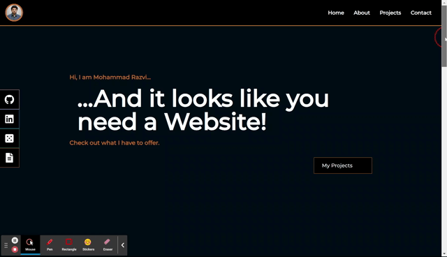

# My-Portfolio

This webpage was created to introduce myself while showcasing my skills & projects to potential clients & employers.

The layout is simple to make navigation easy for all users and has been styled well to give it a clean look. This webpage itself is a project that helps sell me to the people that visit the page.

 

# Deployed link

- [Portfolio](https://moecancode.github.io/portfolio/)

 

# Technologies used

- [React]()
- [CSS](https://developer.mozilla.org/en-US/docs/Web/CSS)
- [Tailwind CSS]()
- [Javascript](https://developer.mozilla.org/en-US/docs/Web/JavaScript)
- [Git/Github](https://github.com/)
- [Chrome Developer Tools](https://developer.chrome.com/docs/devtools/)
- [Node]("https://nodejs.org/en/")

 

 The webpage has a responsive design that made use of flexbox and Tailwind classes to ensure that both, mobile & Desktop users, can have a nice experience on the webpage. However, it is recommended to view the webpage on a Desktop screen because of the several 'Hover' features that have been added to it. They make the user experience even more visually pleasing.

 

# Webpage layout

This is the what the layout of the website looks like on a Desktop screen 
  

 

 

 

# Contributors

**Mohammad Abuzar Razvi**

 

# License

MIT License

Copyright (c) [2022] [Mohammad Abuzar Razvi]

Permission is hereby granted, free of charge, to any person obtaining a copy
of this software and associated documentation files (the "Software"), to deal
in the Software without restriction, including without limitation the rights
to use, copy, modify, merge, publish, distribute, sublicense, and/or sell
copies of the Software, and to permit persons to whom the Software is
furnished to do so, subject to the following conditions:

The above copyright notice and this permission notice shall be included in all
copies or substantial portions of the Software.

THE SOFTWARE IS PROVIDED "AS IS", WITHOUT WARRANTY OF ANY KIND, EXPRESS OR
IMPLIED, INCLUDING BUT NOT LIMITED TO THE WARRANTIES OF MERCHANTABILITY,
FITNESS FOR A PARTICULAR PURPOSE AND NONINFRINGEMENT. IN NO EVENT SHALL THE
AUTHORS OR COPYRIGHT HOLDERS BE LIABLE FOR ANY CLAIM, DAMAGES OR OTHER
LIABILITY, WHETHER IN AN ACTION OF CONTRACT, TORT OR OTHERWISE, ARISING FROM,
OUT OF OR IN CONNECTION WITH THE SOFTWARE OR THE USE OR OTHER DEALINGS IN THE
SOFTWARE